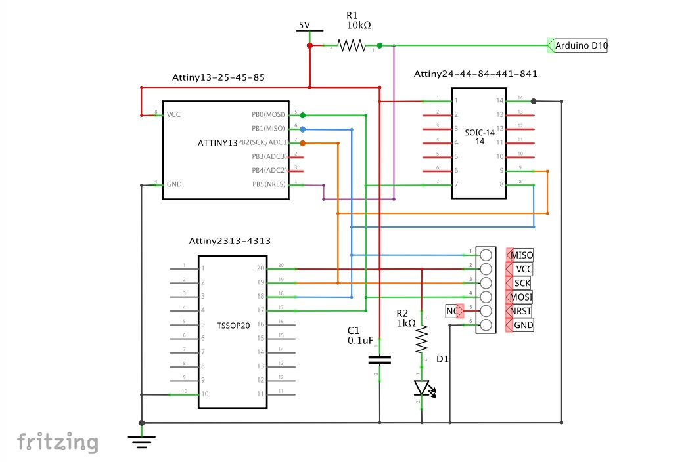
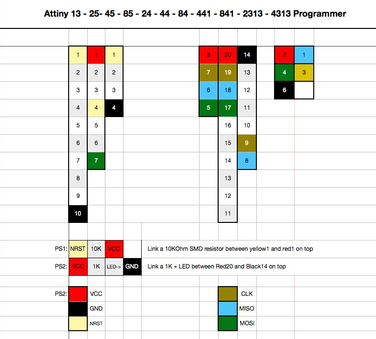
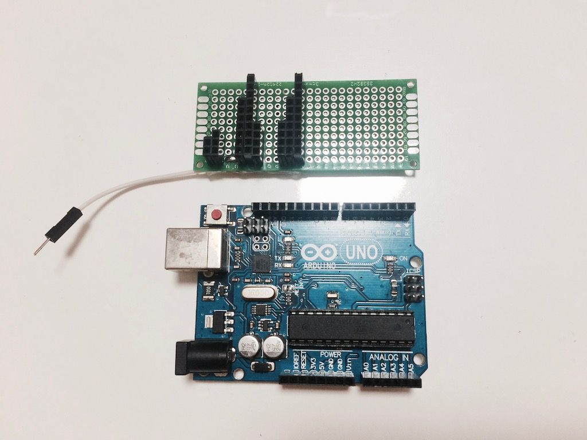

# 1CHIP-Programmers 
## 1. Programmer for Attiny

It can upload sketch to Attiny 13, Attiny 25/45/85, Attiny 24/44/84, Attiny 441/841, Attiny 2313/4313 with Arduno UNO or NANO.

#### Schematic
  

#### Wiring sketch
  
 

#### Picture with Arduino UNO

 

[Video on YOUTUBE](https://youtu.be/lsUCo3aK4AM).

## 2. Programmer for STM32F030

#### Coming soon.

