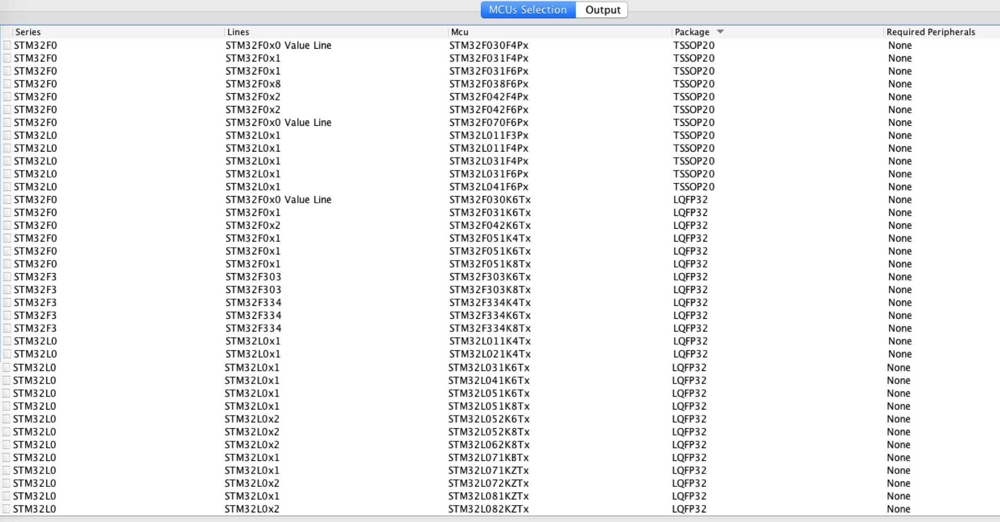
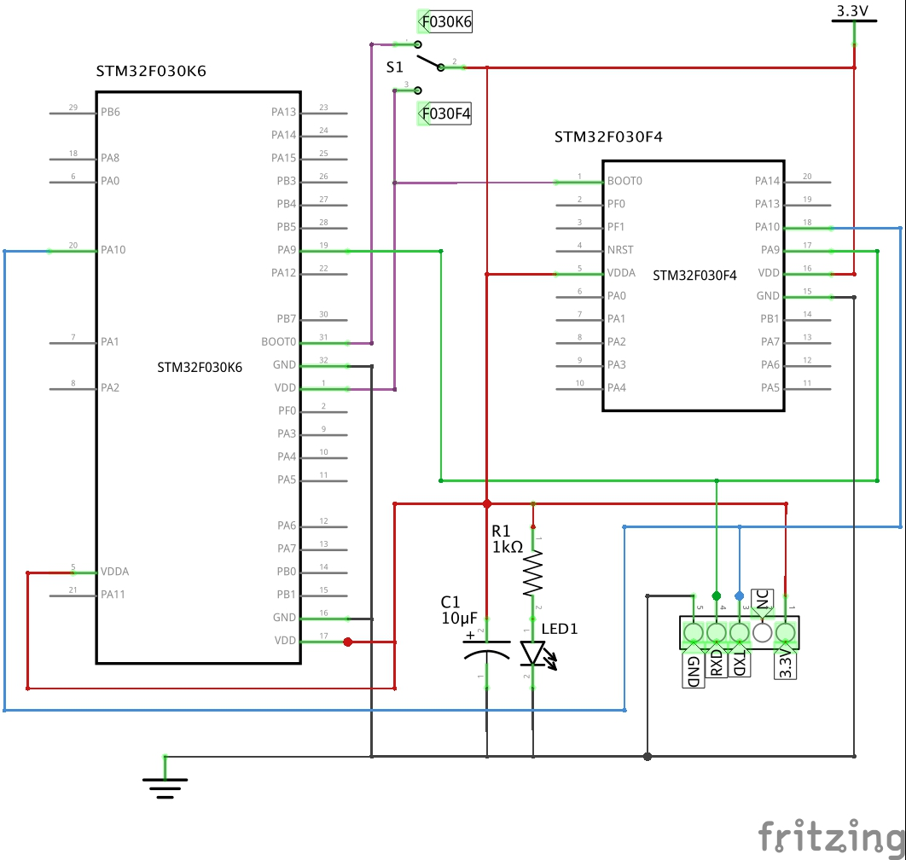
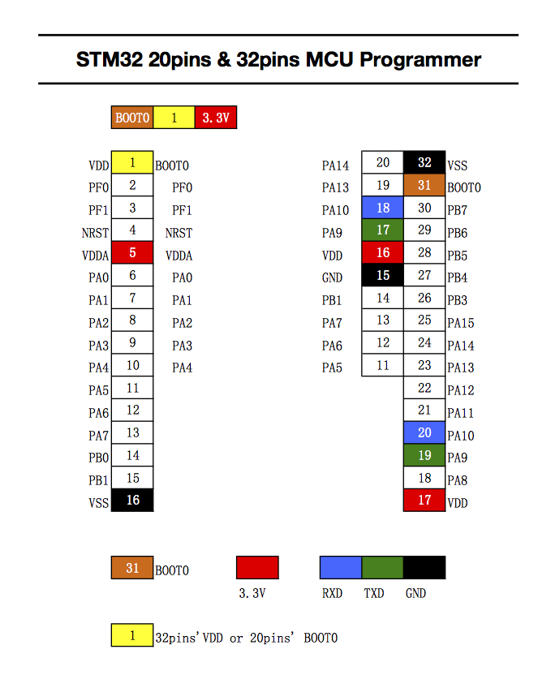
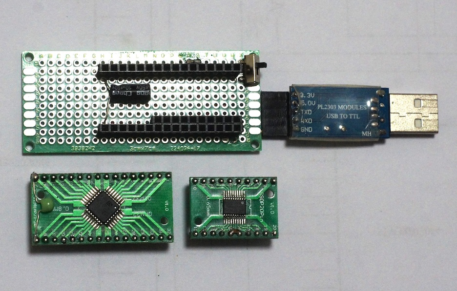

# 1CHIP-Programmers 
## 1. Programmer for Attiny

It can upload sketch to Attiny 13, Attiny 25/45/85, Attiny 24/44/84, Attiny 441/841, Attiny 2313/4313 with Arduno UNO or NANO.

#### Schematic

  

#### Wiring sketch
  
 

#### Picture with Arduino UNO

 

[Video on YOUTUBE](https://youtu.be/lsUCo3aK4AM).

## 2. Programmer for STM32F030

It can upload sketch to Almost all STM32 20pins and 32pins MCU with a USB-TTL adaptor.
Tested on STM32F030F4 and STM32F030K6

#### List of TSSOP20 and LQFP32 STM32 MCU

  

#### Schematic

  

#### Wiring sketch
  
 

#### Picture with USB-TTL adaptor

 

